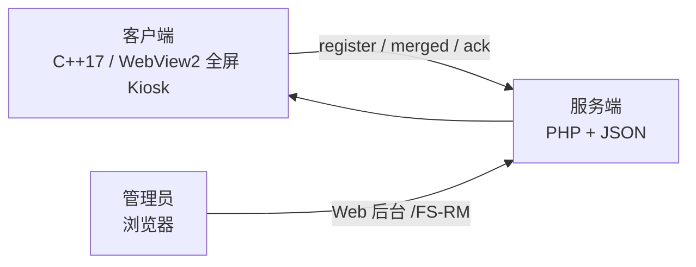

# FullScreen Browser（客户端 + 远程配置服务端）

全屏独占网页浏览器（Kiosk 模式），支持通过自建服务端集中下发配置、按设备/分组差异化管理、远程改密与操作审计。
客户端编译为单个 `.exe`，服务端为轻量 PHP + JSON 存储。

## 系统架构



- **客户端**：Win32 + WebView2 全屏浏览器；启用远程配置后按轮询策略拉取合并配置并热应用；可接收远程改密命令。
- **服务端**：PHP + JSON 存储，提供设备注册、三级合并配置下发（HMAC 签名）、命令下发（远程改密、幂等消费）、Web 管理后台与审计。

## 快速上手（Quick Start）

以“本地起服务端 → 后台建码 → 客户端联调”为例，走通第一个完整闭环：

### 1. 启动服务端（本地）
```bash
cd server
php -S 127.0.0.1:8085 -t public
```
也可以用 Apache 部署（见下文「服务端使用 → 部署（Apache）」），效果一致。

### 2. 初始化后台管理员
浏览器打开 `http://127.0.0.1:8085/FS-RM` → 首次访问自动进入初始化页 → 创建管理员账号（用户名 + 密码）。

### 3. 登录后台并生成注册码
- 登录 `http://127.0.0.1:8085/FS-RM`
- 进入「设备管理」→「生成注册码」面板 → 选过期时长（例如 1 天）→ 点「生成注册码」→ 复制生成的码（形如 `RC-XXXXXXXX`）

### 4. 配置客户端并注册
- 首次运行 `FullScreenBrowser.exe`，在设置对话框里：
  - 填目标网页 URL（如 `https://example.com`）与操作密码
  - 勾选 *Enable remote configuration*，*Remote server URL* 填 `http://127.0.0.1:8085`
- 保存后启动，弹出 *Device Registration* → 粘贴第 3 步的注册码 → 确定
- 服务端发放设备 token，本机存入 `%APPDATA%\FullScreenBrowser\remote_token.dat`

### 5. 验证注册成功
- 后台「设备管理」页应出现新设备（设备 ID 形如 `FSB-<GUID>`）
- 「审计日志」可看到 `register_success`

### 6. 下发第一条配置
- 后台「配置管理」→ 目标选 `global` → 在 Config JSON 中填入字段（例如 `{"refreshIntervalSec":60}`）→ 发布
- 客户端在下一个轮询周期（默认 30s 起，随机 ±30s）拉到并热应用
- 「审计日志」会看到 `merged_served` 与 `ack_received` 记录

### 7.（可选）远程改密
- 「设备管理」→「下发远程改密」→ 选择设备 + 新密码 → 下发
- 客户端在有效期内消费，服务端标记已消费（幂等）

> 提示：改动配置后客户端默认最多约 60s 内生效；若长时间无反应，检查：服务器地址是否可访问、注册码是否已被占用、设备 token 是否丢失（需重新注册）。

## 功能特性

### 客户端
- **全屏独占** — 覆盖整个桌面（含任务栏），窗口置顶，鼠标自动隐藏
- **防关闭保护** — Kiosk 锁屏：屏蔽键盘与鼠标操作，仅放行 `ESC` / `Alt+F4` / `Alt+Tab`
- **密码保护** — 退出/修改设置需密码，连续 5 次错误自动冷却锁定
- **WebView2 渲染** — Edge Chromium 内核
- **URL 可达性监测** — 不可达显示自定义提示，恢复后自动重新加载
- **远程配置** — 从服务端拉取合并配置并热应用（URL/缩放/刷新/烧屏保护/提示语等）
- **远程改密** — 接收服务端下发的改密命令，有效期内消费并回执
- **单文件部署** — 编译产物为单个 `.exe`，无需额外 DLL

### 服务端
- 设备注册（一次性注册码 + 设备独立 token，token 仅存哈希）
- 合并配置下发（`global → group → device` 三级覆盖，HMAC-SHA256 签名）
- 命令下发（远程改密，消费幂等 + ack 闭环）
- Web 管理后台：控制台 / 设备 / 配置 / 审计
- 配置历史与回滚、审计日志

## 快捷键

| 快捷键 | 功能 |
|--------|------|
| `ESC` / `Alt+F4` | 弹出密码验证 → 退出或修改设置 |

## 客户端使用说明

1. **首次运行** — 弹出设置对话框，配置：
   - 目标网页 URL（需以 `http://` 或 `https://` 开头）
   - 操作密码（退出/修改设置用）
   - 不可达提示信息
   - 页面缩放比例（50% - 300%）
2. **启用远程配置**（对话框中的 *Enable remote configuration*）：
   - 勾选后填写 **远程服务器 URL**（*Remote server URL*），即服务端 API 根地址，例如 `http://127.0.0.1:8085`
3. **首次注册** — 若本机未保存设备 token，会弹出 *Device Registration* 对话框，输入服务端管理员生成的一次性注册码
4. **设备 ID** — 首次注册时自动生成为 `FSB-<GUID>`；之后沿用
5. **后续运行** — 直接全屏加载目标网页；启用远程时按服务端下发的轮询参数定时拉取配置并热应用

> 修改设置对话框中的 URL/缩放/刷新等本地项后，若远程配置生效，服务端下发值会覆盖本地对应项；远程改密命令生效后本机密码被更新。

## 客户端配置存储

目录：`%APPDATA%\FullScreenBrowser\`

| 文件 | 说明 |
|------|------|
| `config.dat` | 主配置（v4 格式），密码以 XOR+Base64 混淆存储 |
| `remote_token.dat` | 设备 token（DPAPI 加密） |
| `consumed_commands.dat` | 已消费的改密命令 ID（幂等依据） |
| `WebView2\` | WebView2 浏览器数据目录 |

- 删除 `config.dat` 可恢复为首次运行状态
- 删除 `remote_token.dat` 会要求重新注册（用新的注册码）

## 编译（客户端）

### 环境要求
- Visual Studio 2022（Community 或以上）
- WebView2 SDK（NuGet 包）

### 步骤
```batch
:: 1. 安装 WebView2 SDK
nuget install Microsoft.Web.WebView2 -OutputDirectory packages

:: 2. 在 x64 Native Tools 命令提示符中编译
build.bat
```

编译产物：`build\FullScreenBrowser.exe`

## 服务端使用（详细）

### 环境要求
- PHP 8.0+（含 `mbstring`）
- 方式 A：Apache（推荐，需 `mod_rewrite` / `FallbackResource` 支持）
- 方式 B：PHP 内置服务器（开发调试）

### 目录结构
```
server/
├─ public/           Web 入口（index.php）
├─ src/              业务逻辑（App/Auth/Storage/ManagementService 等）
├─ tools/            CLI 运维工具
├─ storage/          JSON 数据（设备/配置/审计/密钥/管理员）
├─ runtime/          文件锁与临时文件
└─ examples/         发布示例 JSON
```

### 部署（Apache）
监听 `127.0.0.1:8085` 的 vhost 示例（`DocumentRoot` 指向 `server/public`）：

```apache
Listen 127.0.0.1:8085
<VirtualHost 127.0.0.1:8085>
    ServerName 127.0.0.1
    DocumentRoot "绝对路径/server/public"
    <Directory "绝对路径/server/public">
        Options FollowSymLinks
        AllowOverride None
        Require all granted
        DirectoryIndex index.php
        FallbackResource /index.php
    </Directory>
</VirtualHost>
```

> 关键点：`FallbackResource /index.php` 是 `/FS-RM` 与 `/api/*` 路由可达的前提。改完 `httpd.conf` 需重启 Apache 生效。

开发模式（无需 Apache）：

```bash
php -S 127.0.0.1:8085 -t server/public
```

### 首次初始化（管理员）
浏览器访问 `http://127.0.0.1:8085/FS-RM` → 自动跳转初始化页 → 创建管理员账号。
管理员信息存于 `storage/admin_auth.json`（密码 `password_hash` 存储），删除该文件即可重置为未初始化。

### Web 管理后台
登录后使用（均为 `/FS-RM` 下）：

| 页面 | 路径 | 用途 |
|------|------|------|
| 控制台 | `/FS-RM` | 设备数、分组数、全局版本、审计统计 |
| 设备管理 | `/FS-RM/devices` | 设备列表、分组管理（设备划入 group）、下发远程改密 |
| 配置管理 | `/FS-RM/config` | 选择 global/group/device → 查看当前配置与继承预览 → 发布新版本；回滚 |
| 审计日志 | `/FS-RM/audit` | 按 action / deviceId / limit 筛选操作记录 |

### 配置下发流程（端到端）
1. **生成注册码**：管理员在服务端生成一次性注册码（见下方“生成注册码”）
2. **注册**：客户端填入服务器地址 + 注册码 → `POST /api/v1/device/register` → 服务端校验并消费注册码，发放设备 token（服务端仅存 `sha256` 哈希）
3. **拉取合并配置**：客户端周期性 `GET /api/v1/config/merged`（带 `Authorization: Bearer <token>`）→ 服务端按 `global → group → device` 合并并附 HMAC 签名
4. **应用与回执**：客户端验签、应用后 `POST /api/v1/config/ack`
5. **远程改密**：后台下发 `password_update` 命令，客户端在有效期内消费，服务端标记已消费（幂等）

### 可下发配置字段（白名单）
`url`、`zoomPercent`、`refreshMode`、`refreshIntervalSec`、`refreshDailyMin`、`burnInPrevention`、`unreachableMsg`、`allowRemotePasswordUpdate`

### 合并优先级
`global`（所有设备）→ `group`（按设备所属分组）→ `device`（单设备覆盖）；最终合并结果再做白名单过滤。

### 生成注册码
- 方式一（推荐）：后台“设备管理”页 → “生成注册码”面板。可选过期时长（1 小时 / 1 天 / 7 天 / 30 天）、可自定义码或留空自动生成（`RC-XXXXXXXX`），生成后显示并一键复制；页面同时列出未使用的注册码。
- 方式二（CLI，会同时播种演示配置）：`php tools/init_demo_data.php --register-code DEMO-001 --device-id dev-001`
- 方式三（仅生成注册码，手动写入 `storage/register_codes.json`）：
```json
{
  "codes": [
    { "code": "DEMO-001", "expires_at": 9999999999, "used": false }
  ]
}
```
`expires_at` 为 Unix 秒；注册码一次性使用，使用后自动置 `used=true`。

### CLI 工具（在 `server/` 目录下）
```bash
# 预检发布内容
php tools/precheck_config.php --file examples/publish-global.json

# 发布配置（global 全量）
php tools/publish_config.php --file examples/publish-global.json
php tools/publish_full_rollout.php --file examples/publish-global.json

# 按历史版本回滚
php tools/rollback_config.php --scope global --revision 2 --operator ops-admin --note "rollback"

# 查询审计
php tools/query_audit.php --limit 50
php tools/query_audit.php --action config_published --limit 20
php tools/query_audit.php --device-id dev-001 --limit 20

# 下发远程改密
php tools/enqueue_password_update.php --device-id dev-001 --password NewPass123 --operator ops-admin --note "rotate"

# 初始化演示数据
php tools/init_demo_data.php
```

### 存储文件说明
| 文件 | 内容 |
|------|------|
| `devices.json` | 设备（token 哈希、状态、分组、在线时间） |
| `register_codes.json` | 一次性注册码 |
| `config_global.json` / `config_group.json` / `config_device.json` | 三级配置 |
| `config_history.json` | 发布/回滚历史（可回滚） |
| `password_updates.json` | 远程改密命令队列 |
| `audit_logs.json` | 审计日志 |
| `admin_auth.json` | 管理员账号 |
| `server_secret.json` | 服务端全局密钥（预留） |

### API 一览
| 方法 | 路径 | 说明 |
|------|------|------|
| GET | `/health` | 健康检查 |
| POST | `/api/v1/device/register` | 设备注册（注册码换 token） |
| GET | `/api/v1/config/merged` | 拉取合并配置 + 命令（Bearer 鉴权） |
| POST | `/api/v1/config/ack` | 应用回执（含命令消费结果） |
| GET/POST | `/FS-RM*` | 管理后台（登录/初始化/页面/操作） |

### 安全说明
- 生产环境必须通过 **HTTPS** 对外提供
- 注册码一次性、短期有效；设备 token 仅存哈希
- 合并响应带 HMAC-SHA256 签名（客户端验签）
- 后台会话：HttpOnly + SameSite=Lax Cookie，表单带 CSRF 校验
- 远程改密命令在服务端以 XOR+Base64 混淆传输（非强加密，仅依赖 HTTPS 防窃听；生产环境不要走明文 HTTP）
- 后台操作均写入审计日志

## 技术栈

- 客户端：C++17 / Win32 API / WebView2（Edge Chromium）/ MSVC 静态 CRT
- 服务端：PHP 8+ / JSON 文件存储